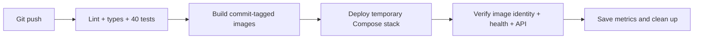

# Task 3 — Automated CI/CD

**Progree DevOps Internship · Haseeb Ullah**

[](https://github.com/haseeb9876/progree-task-3-cicd/actions/workflows/task3-ci-cd.yml)

Automatically check, build, deploy, and verify the Wanderlust application after
a code push. This is the **standalone Task 3 repository**. It includes the app
and Docker configuration needed to run its pipeline without another checkout.

## Start here

| Item | Link |
| --- | --- |
| Live workflow history | [GitHub Actions](https://github.com/haseeb9876/progree-task-3-cicd/actions/workflows/task3-ci-cd.yml) |
| Assignment walkthrough | [Task 3 guide](docs/README.md) |
| Presentation checklist | [How to demonstrate this task](docs/PRESENTATION.md) |
| Submission evidence | [Task 3 PDF](docs/Task-3-CICD-Report.pdf) |
| Successful and blocked deployments | [Recorded evidence](docs/evidence/README.md) |
| Separate Task 2 project | [Containerization repository](https://github.com/haseeb9876/progree-task-2-containerization) |

## What happens after a push



Quality failures block both build and deployment. The Actions page displays job
outcomes, 28 backend and 12 frontend test results, selected-module coverage,
startup time, deployed commit, health, and downloadable evidence.

Deployment runs on a temporary GitHub-hosted runner and is removed after checks.
It is not a permanent public website and does not deploy to your laptop.
Pull requests run quality and build checks without deployment.

## Run the application locally

Requires Docker Engine, Docker Compose, and Python 3.

```bash
git clone https://github.com/haseeb9876/progree-task-3-cicd.git
cd progree-task-3-cicd
python3 scripts/setup-local.py
docker compose up -d --build --wait --wait-timeout 180
python3 scripts/seed-demo.py
```

Open **http://localhost:8083**. Check with `python3 scripts/verify-stack.py`.
Stop with `docker compose down`, which preserves database volumes.

## Project map

```text
.github/workflows/  GitHub Actions stages and deployment dependencies
scripts/ci/         Image identity checks, deployment, and status summaries
frontend/           React application and component/unit tests
backend/            Express application and unit tests
docker/             MongoDB/Redis startup configuration
scripts/            Local setup, verification, and report generation
docs/               Guide, presentation, PDF, evidence, and attribution
compose.yaml        Self-contained four-service deployment
```

## Run quality checks locally

With Node.js 22 and npm installed:

```bash
npm ci --prefix backend
npm ci --prefix frontend
npm run lint --prefix backend
npm run lint --prefix frontend
npm run typecheck --prefix frontend
npm run test:ci --prefix backend
npm run test:ci --prefix frontend
```

The local Docker project is `progree-task3` and uses port 8083. GitHub overrides
the project name per run and uses port 8080 inside its isolated runner.

## Attribution and scope

Wanderlust is reused under its preserved [MIT license](LICENSE), with original
credit to [Krishna R Acharya and contributors](https://github.com/krishnaacharyaa/wanderlust).
Containerization provides the deployment foundation; CI/CD, tests, reporting,
and verification are the Task 3 contribution. See [provenance](docs/provenance.md).
