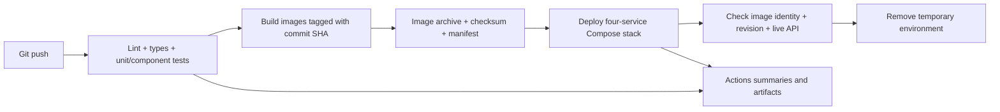

# Task 3 — Multi-Stage Automated CI/CD Deployment Pipeline

This task automates the Task 2 application with GitHub Actions. A remote push
checks out the pushed code, lints both applications, runs unit/component tests,
builds the Docker images, deploys them to a temporary test environment, verifies
the live API, and records results in the Actions interface.

## Assignment requirement mapping

| Requirement from the internship PDF | Implementation |
| --- | --- |
| Workflow runs on remote pushes | `push` trigger on `.github/workflows/task3-ci-cd.yml`; pull requests and manual runs also supported |
| Automatically pull code | Pinned `actions/checkout` in each job |
| Static application linting | ESLint for backend and frontend; frontend TypeScript check |
| Unit-testing suites | Jest backend unit tests and deterministic frontend component/unit tests |
| Multi-stage automated deployment | Quality checks gate image builds; successful builds supply exact images to the deployment job |
| Deployment output/status metrics on execution boards | GitHub job graph, test/coverage summaries, deployment summary, commit identity, startup time, health, and uploaded evidence |

## Pipeline



Every push in this repository is eligible for a temporary test deployment.
Pull requests run quality and build checks, but do not deploy. `needs` dependencies
block build and deployment if lint, type checking, or tests fail. Test failures
are not ignored. The backend's inherited `process.exit(0)` test teardown was
removed so Jest controls the true exit status.

## Where it deploys

The deployment runs on an Ubuntu GitHub-hosted runner under the `task3-test`
GitHub environment. Nginx, Express, MongoDB, and Redis actually start, and the
pipeline sends HTTP requests to that running stack. It is removed at the end of
the job. It is **not a persistent public website** and does not update the standalone local
Task 3 demo. No self-hosted runner, SSH server, cloud account, or registry password
is required for this demonstration.

This covers the PDF's automated testing/integration and deployment reporting
objective. A persistent cloud deployment is separate infrastructure work; Task 4
can later provide the Kubernetes target.

## Quality checks

The workflow installs locked dependencies with `npm ci` and uses Node.js 22.
Backend unit tests exercise post-controller success/error paths and the cache
invalidation fix, including invalidation only after a successful database write.
Frontend tests verify loading placeholders, rendered posts, category filtering,
navigation, and URL slugs using fixed API fixtures rather than a live backend.

Frontend static checks use ESLint's recommended JavaScript/TypeScript and React
Hooks rules, plus a separate TypeScript check. This replaces the inherited lint
configuration that could not run without parser project settings. Source issues
found by lint were fixed, including unused parameters, component capitalization,
an effect dependency, and unsafe error typing. The older backend live-database
tests remain in the source for reference; real-stack verification uses
`scripts/verify-stack.py` against the deployed containers.

Coverage percentages are shown for the selected application modules listed in
the Jest configuration; they are not a claim of whole-application coverage.

## Image and deployment verification

1. Build images tagged with the triggering commit SHA and label them with that SHA.
2. Record image IDs, revision labels, and sizes in `image-manifest.json`.
3. Transfer the image archive as a GitHub artifact with a SHA-256 checksum.
4. Verify the checksum and load the archive in a fresh deployment job.
5. Generate temporary credentials on the runner and start Compose with `--no-build`.
6. Verify the running image IDs and labels match the build manifest.
7. Check `/health/live` returns the triggering commit and `/health/ready` reports ready.
8. Exercise post validation, signup/signin, create/read/update/delete, and cache behavior.
9. Save redacted logs, service status, timing, and test output, then clean up.

The archive is an inter-job deployment artifact, not a published container registry
package. Pinning actions/base images and locked npm dependencies makes inputs
explicit; dependency updates should be reviewed and retested.

## Find the results

Open the repository's **Actions** tab, choose **Task 3 - CI and test deployment**,
and select a run. Review the job graph and the summary cards. Uploaded artifacts:

- `tests-backend-*` and `tests-frontend-*`: test JSON and selected-module coverage (14 days).
- `build-output-*`: Docker build logs (14 days).
- `application-images-*`: image archive, checksum, and manifest (3 days).
- `deployment-evidence-*`: commit, startup time, status, service logs, and API checks (14 days).

A final status-board job runs even when an earlier job fails, so skipped stages
remain visible. The normal workflow result remains failed if a required stage
fails, regardless of the reporting job's success.

## Local quality checks

```bash
npm ci --prefix backend
npm ci --prefix frontend
npm run lint --prefix backend
npm run lint --prefix frontend
npm run typecheck --prefix frontend
npm run test:ci --prefix backend
npm run test:ci --prefix frontend
```

The local `docker compose up -d --build --wait` command runs this standalone app on port 8083.
`IMAGE_TAG` and `APP_REVISION` default to `local` and `local` for local builds.
CI overrides them with the pushed SHA and uses a unique Compose project name.
Do not run CI cleanup commands against your normal local project.

## Scope of completion

A real successful GitHub Actions deployment and a controlled failed-test run
have been verified. Build and deployment were skipped after the deliberate failure.
See the [saved evidence](evidence/README.md) and [Task 3 PDF](Task-3-CICD-Report.pdf). The temporary test environment is
removed after verification; the report does not claim a permanent deployment.

The Task 3 PDF is a component for the organizer's final combined internship PDF.
It is not submitted automatically. Task 4 remains separate work.

## Regenerate the report

With the optional Python `reportlab` package installed:

```bash
python3 scripts/build-report.py
```

This reads the saved run evidence. It does not invent new execution results.

## References

- [GitHub workflow syntax](https://docs.github.com/en/actions/reference/workflows-and-actions/workflow-syntax)
- [GitHub job summaries](https://docs.github.com/en/actions/reference/workflows-and-actions/workflow-commands)
- [GitHub artifacts](https://docs.github.com/en/actions/how-tos/manage-workflow-runs/download-workflow-artifacts)
